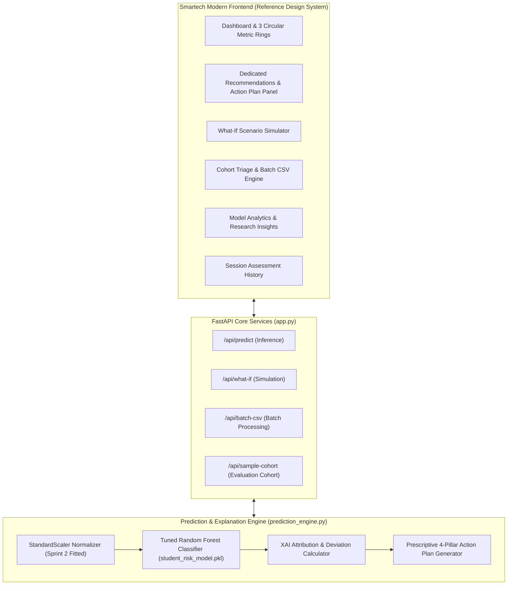

# Student Academic Risk Early-Warning System (Smartech)
## End-to-End System, Model, & Interpretation Guide

**Course:** Intro to AI · End of Semester Project  
**Team (Group 5):** Daniel, Victoria, Esbert, and Vera  
**Application Platform:** Smartech AI Decision Support & Intervention Planning Dashboard  

---

## 1. System Goal & Business Objective

### 🎯 Primary Mission
In secondary and higher education, academic failure rarely occurs suddenly; it develops over time as attendance slips, early grades decline, or lifestyle and personal pressures mount. Traditional end-of-term evaluations flag failure only after it has occurred, when it is too late for remedial action.

The **Student Academic Risk Early-Warning System** solves this challenge by serving as an **AI-powered decision support cockpit for academic advisors, class tutors, and student success counselors**. By analyzing early academic performance ($G1$), attendance records, and behavioral indicators, the system:
1. **Accurately forecasts final academic risk** ($G3$ failure probability) weeks before final examinations.
2. **Explains the exact root causes** behind each prediction using Explainable AI (XAI) feature attribution.
3. **Generates targeted, step-by-step prescriptive interventions** across academic tutoring, attendance retention, time-management coaching, and counseling.
4. **Enables "What-If" scenario simulation** to quantify how specific behavioral adjustments (e.g. attendance adherence) improve student outcomes.

---

## 2. Technical Stack & Architecture



### Technology Highlights:
- **Backend**: Python 3.13, FastAPI, Uvicorn, Scikit-Learn, Joblib, Pandas, NumPy.
- **Frontend**: Vanilla HTML5, CSS3 Custom Properties (Modern Neumorphic / Soft Minimalist design system matching executive SaaS dashboards), ES6 JavaScript.
- **Machine Learning**: Tuned Random Forest Classifier with 5-Fold Cross-Validation, serialized via Joblib (`student_risk_model.pkl` / `student_risk_pipeline.pkl`).

---

## 3. Features & Modules Breakdown

### 📊 Module 1: Dashboard & Live Assessment Cockpit
- **Personalized Greeting & Archetypes**: Instant one-click presets (*High Risk*, *Borderline*, *Thriving*, *Social Drift*) for rapid demonstration.
- **Structured Parameter Controls**: Clean sliders in soft pill containers organized into:
  - *Academic Standing*: First Period Grade ($G1 \in [0, 20]$), Past Failures ($0-3$).
  - *Attendance & Habits*: Term Absences ($0-40+$), Free Time ($1-5$), Going Out with Friends ($1-5$), Weekend Alcohol ($1-5$).
  - *Lifestyle & Family*: Health Rating ($1-5$), Student Age ($15-22$), Mother's Education ($0-4$), Family Relationships ($1-5$).
- **Vertical Metrics Rail (Reference Design)**:
  - **Academic Risk Score Ring**: Circular progress gauge displaying composite risk intensity ($0-100\%$) and color-coded risk badge.
  - **Model Confidence Ring**: Classification certainty ($0-100\%$).
  - **$G1$ Score Band Ring**: Visualizes early term grade against the critical risk cutoff ($G1 \le 9$).

---

### 💡 Module 2: Dedicated Recommendations & Intervention Plan Panel
Accessible via the sidebar navigation or the "See Full Intervention Plan" button on the dashboard:
- **4 Structured Intervention Pillars**:
  1. 📚 **Academic Tutoring & Remediation**: Specific peer tutoring assignments, diagnostic testing, and homework review schedules.
  2. ⏱️ **Attendance & Credit Retention**: Formal attendance contracts, automated absence alerts, and dean consultations.
  3. 🧘 **Student Life, Habits & Social Balance**: Time-management calendar templates, sleep hygiene, and weekend revision balance.
  4. 🤝 **Personal Counseling & Wellbeing**: Confidential health center referrals and emotional support check-ins.
- **Interactive Checklists**: Counselors can interactively check off action steps as they are scheduled or completed.
- **Urgency Badges & Timelines**: Clear priority levels (*Urgent*, *Moderate*, *Maintenance*) and realistic deadlines (*Within 48 hours*, *Next 1-2 weeks*).

---

### ⚡ Module 3: "What-If" Scenario Simulator
- Enables advisors to test hypothetical student improvements side-by-side:
  - *Example*: What happens if a student with 18 absences and $G1=6$ attends all classes (reducing absences to 2) and raises their grade to $G1=14$?
- Displays real-time **Risk Drop (-54.2 points)**, **Failure Probability Drop (-72.4%)**, and **Zone Transition (High Risk ➔ Low Risk)**.

---

### 📂 Module 4: Cohort Triage & Batch CSV Processing
- Upload raw student CSV files (e.g. `student-por.csv`) or click **"Load 98-Student Sample Cohort"** with one click.
- Generates cohort health KPI cards: Total Cohort Size, High Risk count & %, Medium Risk, Low Risk.
- Searchable and filterable data table with one-click **CSV Report Export**.

---

### 📈 Module 5: Model Analytics & Research Insights
- Comparative metrics from Sprint 1 baseline to Sprint 2 final tuned model.
- Interactive **Confusion Matrix** with safety analysis.
- **Feature Importance Rankings** visualizing relative feature contributions.

---

### 📜 Module 6: Session History Log
- Records every profile assessed during the session in `localStorage`.
- Allows clearing history or downloading a timestamped CSV report.

---

## 4. Machine Learning Model & Pipeline Details

### 📂 Dataset Source
- Derived from the UCI Machine Learning Repository Portuguese Student Performance Dataset (`student-por.csv`, $N=649$).

### 🎯 Target Variable Construction ($G3 \rightarrow \text{Risk Level}$)
The final grade $G3$ (scored from 0 to 20) was mapped into three ground-truth risk categories:

| Target Category | Final Grade Range ($G3$) | Academic Status | Required Action |
| :--- | :---: | :--- | :--- |
| 🔴 **High Risk** | $G3 \le 9$ | Course Failure Band | Urgent academic advising & peer tutoring |
| 🟡 **Medium Risk** | $10 \le G3 \le 14$ | Passing but Vulnerable | Academic check-ins & study group support |
| 🟢 **Low Risk** | $G3 \ge 15$ | High Academic Standing | Enrichment, leadership, & honors tracks |

### 🛠️ Feature Selection & Dimensionality Reduction
In Sprint 1, all 30 features were utilized. In Sprint 2, Random Forest Feature Importance ranking identified that **the top 10 features capture the vast majority of predictive variance**, allowing a 66% reduction in feature dimensionality with an improvement in model accuracy:

| Rank | Feature | Description | Importance | Risk Direction |
| :---: | :--- | :--- | :---: | :---: |
| 1 | **G1** | First Period Grade ($0-20$) | **44.7%** | $\downarrow$ Lower score increases risk |
| 2 | **failures** | Past Course Failures ($0-3$) | **17.0%** | $\uparrow$ Higher failures increase risk |
| 3 | **absences** | Term Absences ($0-40+$) | **10.8%** | $\uparrow$ More absences increase risk |
| 4 | **age** | Student Age ($15-22$) | **5.7%** | $\uparrow$ Older age correlates with retention |
| 5 | **health** | Health Status ($1-5$) | **4.6%** | $\downarrow$ Lower health increases risk |
| 6 | **freetime** | Free Time After School ($1-5$) | **4.4%** | $\uparrow$ High unstructured time increases risk |
| 7 | **Walc** | Weekend Alcohol Use ($1-5$) | **3.8%** | $\uparrow$ Higher alcohol increases risk |
| 8 | **goout** | Socializing Frequency ($1-5$) | **3.5%** | $\uparrow$ High socializing increases risk |
| 9 | **Medu** | Mother's Education ($0-4$) | **3.1%** | $\downarrow$ Lower education increases risk |
| 10 | **famrel** | Family Relationship ($1-5$) | **2.4%** | $\downarrow$ Strained relationships increase risk |

### 🏆 Model Performance Comparison

```mermaid
gantt
    title Model Evolution (Sprint 1 vs Sprint 2)
    dateFormat X
    axisFormat %s
    section Sprint 1 Baseline RF
    Accuracy 76.5% : 0, 765
    section Sprint 2 Tuned RF
    Accuracy 80.6% : 0, 806
```



| Metric | Sprint 1 Baseline RF (30 Features) | Sprint 2 Tuned RF (Top 10 Features) | Improvement |
| :--- | :---: | :---: | :---: |
| **Test Accuracy** | 76.5% | **80.6%** | **+4.1%** |
| **Macro F1-Score** | 0.682 | **0.710** | **+0.028** |
| **Weighted F1-Score** | 0.760 | **0.791** | **+0.031** |
| **High $\rightarrow$ Low Errors** | 1.0% | **0.0% (Zero Errors)** | **100% Safe** |

---

## 5. How to Interpret Results (Advisor Playbook)

### Step 1: Examine the Predicted Risk & Risk Score Ring
- **🔴 High Risk ($Score \ge 70\%$)**: Student is on trajectory to fail the course ($G3 \le 9$). Immediate advisor consultation required.
- **🟡 Medium Risk ($40\% \le Score < 70\%$)**: Student is passing but has limited cushion. Vulnerable to attendance slippage or difficult midterm topics.
- **🟢 Low Risk ($Score < 40\%$)**: Student has strong mastery and supportive habits.

### Step 2: Review the XAI Factor Attribution
- Look at the **Risk Elevating Indicators** (marked in Red). Is the primary driver a low $G1$ score, excessive absences, or lifestyle strain?
- Note any **Protective Factors** (marked in Green) that can be leveraged (e.g. strong family support or good health).

### Step 3: Navigate to the "Recommendations" Tab
- Review the 4 Action Pillars generated specifically for this student.
- Assign the designated peer tutor, send the attendance contract, or provide time-management calendar templates.
- Check off items as they are executed during the advisory meeting.

### Step 4: Validate Progress in the "What-If Simulator"
- Share the What-If simulation with the student to establish clear, motivating goals (e.g., *"If you attend all remaining classes and raise your assignment scores by 3 points, your risk category shifts to Low Risk"*).

---

## 6. How to Run the System

### Start the Web Application
```powershell
python app.py
```
Open **[http://127.0.0.1:7860](http://127.0.0.1:7860)** in any modern web browser.

### Start the Gradio Interface
```powershell
python gradio_app.py
```
Open **[http://127.0.0.1:7861](http://127.0.0.1:7861)** in your browser.
